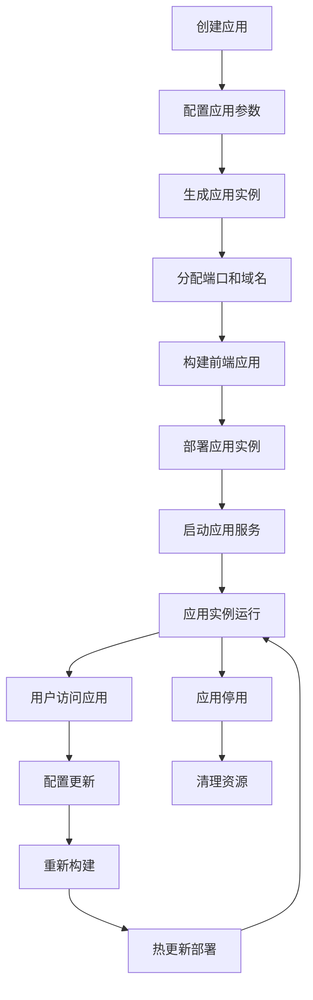

# AINO 系统架构整合方案

## 📋 概述

本文档描述了 AINO 无代码平台从静态展示系统升级为动态应用生成平台的完整架构整合方案。该方案将 AINO-studio（管理后台）、AINO-server（后端服务）和 AINO-APP（前端应用）整合为一个完整的动态应用生成系统。

## 🎯 项目背景

### 当前状态
- **AINO-studio**：完整的管理后台，支持应用创建、模块配置、用户管理
- **AINO-server**：完整的后端服务，提供 42 个 API 接口，支持 11 个核心模块
- **AINO-APP**：静态展示的前端应用，需要与后端动态对接

### 目标状态
- **动态应用生成**：通过 AINO-studio 配置生成独立的前端应用实例
- **多租户架构**：每个应用都有独立的前端实例和用户体系
- **完整业务闭环**：从应用创建到用户使用的完整业务流程

## 🏗️ 整体架构设计

### 系统架构图

```
┌─────────────────────────────────────────────────────────────┐
│                    AINO 完整系统架构                          │
├─────────────────────────────────────────────────────────────┤
│  AINO-studio (管理后台) - 端口 3000                          │
│  ├── 应用创建与管理                                          │
│  ├── 模块配置与安装                                          │
│  ├── 用户权限管理                                            │
│  ├── 页面配置与发布                                          │
│  └── 应用实例管理                                            │
├─────────────────────────────────────────────────────────────┤
│  AINO-server (后端服务) - 端口 3001                          │
│  ├── 应用管理 API                                            │
│  ├── 模块系统 API                                            │
│  ├── 用户体系 API                                            │
│  ├── 动态字段 API                                            │
│  ├── 关联关系 API                                            │
│  └── 应用实例 API                                            │
├─────────────────────────────────────────────────────────────┤
│  AINO-APP (动态前端生成器) - 端口 3002+                      │
│  ├── 应用实例 1 (端口 3002)                                  │
│  │   ├── 独立域名/子域名                                      │
│  │   ├── 自定义主题                                          │
│  │   ├── ToC 用户系统                                        │
│  │   └── 动态卡片系统                                        │
│  ├── 应用实例 2 (端口 3003)                                  │
│  ├── 应用实例 N (端口 3002+N)                                │
│  └── 每个实例独立运行，对接不同应用数据                       │
└─────────────────────────────────────────────────────────────┘
```

### 核心设计理念

1. **动态应用生成**：基于配置自动生成独立的前端应用实例
2. **多租户隔离**：每个应用完全独立，数据、用户、权限完全隔离
3. **配置驱动开发**：通过 AINO-studio 配置生成完整的前端应用
4. **模块化架构**：支持模块的插拔和扩展
5. **统一用户体系**：平台管理员、应用管理员、业务用户三层用户体系

### 动态应用生成流程
1. 用户在 AINO-studio 中配置模块、字段、视图与权限。
2. 系统将配置保存为 Manifest，并同步至 AINO-server。
3. AINO-server 根据 Manifest 自动生成 API、数据模型和索引策略。
4. AINO-APP 前端根据 Manifest 渲染 UI，支持热更新与动态扩展。

### 近期落地进展（2025-09）
- 预览链路：
  - 后端新增 `POST/GET/PUT /api/preview-manifests[:id]`，以文件存储保存预览 Manifest。
  - Studio 生成 `previewId` 后在右侧 iframe 渲染 `/{locale}/preview/{id}`；仅移动端优先。
  - AINO-APP 预览页读取 Manifest，并将 `app.bottomNav` 同步为全局导航（`CURRENT_APP_NAV_ITEMS`）。
- Studio 编辑体验：
  - 引入 Monaco Editor（JSONC），绑定 Manifest Schema，支持校验/自动补全/格式化。
  - 采用“文件树”分层编辑：manifest.json、app.json、pages/{key}.json、data-sources.json。
  - 保存仅回写当前范围，再 PUT 预览；导航新增会自动创建对应页面。
- 导航与页面：
  - 默认“我的”指向 `/profile` 并使用各应用自定义导航；旧 `/me` 自动映射。
  - App 底部全局导航在预览与运行时统一渲染（shared BottomNavigation，支持 `iconName`）。

### Manifest 分层（编辑与运行的统一契约）
```json
{
  "schemaVersion": "1.0",
  "app": {
    "appKey": "xxx",
    "locale": "zh-CN",
    "theme": "default",
    "bottomNav": [
      { "key": "home", "label": "首页", "page": "home", "iconName": "home" },
      { "key": "me", "label": "我的", "page": "profile", "iconName": "user" }
    ]
  },
  "pages": {
    "home": {
      "route": "/home",
      "layout": "mobile",
      "data": { "users": { "source": "records", "params": { "dirId": "users" } } },
      "cards": [
        { "id": "listA", "type": "list", "bind": { "context": "users", "select": "$.data.records" } }
      ]
    },
    "profile": { "route": "/profile", "layout": "mobile", "cards": [] }
  },
  "dataSources": {
    "records": { "type": "rest", "method": "GET", "url": "/api/records/{dirId}", "auth": "server" },
    "me": { "type": "rest", "method": "GET", "url": "/api/application-users/me", "auth": "appUser" }
  },
  "actions": {
    "openDetail": { "type": "navigate", "to": "page:detail", "params": { "id": "{{id}}" } }
  }
}
```

要点：
- App 层仅放跨页项（主题、语言、bottomNav 等）。
- Page 层存布局/卡片/页面共享数据（context），卡片 `bind` 可引用 `context` 或直接指定 `source` 并覆盖参数。
- DataSources 独立命名，统一鉴权策略（`auth: server|appUser`），前端自动携带 `x-application-id`。

### 预览运行时行为
- AINO-APP `/[locale]/preview/[id]`：
  - 拉取预览 Manifest 后，如无首页布局，注入 `mobile-navigation` 兜底卡片。
  - 将 `app.bottomNav` 映射为通用底部导航（支持 `iconName`）。
  - 兼容 `/me` → `/profile`。

### 下一步里程碑（短期）
1) 页面编辑器（布局/数据/样式）：
   - 布局：从卡片库拖入、排序、保存到 `pages.{key}.cards`。
   - 数据：为卡片选择 `bind.source/context`、填写 `params`、`select` 路径与可选 `transform`。
   - 样式：引用 `styleRef/designTokens`，不在卡片内散落颜色。
2) 预览稳定化：
   - 预览内路由留在 iframe（`?route=/xxx`），编辑侧只刷新 iframe。
   - “重置预览/清空缓存”与保存状态提示。
3) 发布与版本：
   - `GET/PUT /api/apps/:appId/manifest` 版本化存储（draft/published）。
   - AINO-APP 按 appKey 读取“已发布版本”，预览仍走 previewId。

## 📋 平台愿景与目标

- **业务驱动**：以业务为中心设计模块、字段、视图和权限，避免纯技术视角。
- **统一契约**：以 Manifest 为唯一真相源，确保前后端一致性与高可维护性。
- **智能化规划**：为未来 AI 自动配置（MCP）预留入口，实现智能化开发与运营。
- **多租户架构**：提供企业级安全、可扩展的多租户 SaaS 体系。

## 📝 Manifest 契约标准

Manifest 是 AINO 平台的唯一真相源（Single Source of Truth），描述模块、字段、关系、权限、视图与性能优化策略。所有平台组件均以 Manifest 作为唯一输入：

- **AINO-studio**：负责产出与演进 Manifest。
- **AINO-server**：基于 Manifest 自动注册 API、生成数据模型与索引策略。
- **AINO-APP**：基于 Manifest 渲染 UI（字段、表单、表格、详情、流程等）。

> 详细规范请参考 `AINO-APP/文档/Manifest规范文档.md`，本节聚焦框架级契约与核心结构。

### Manifest 核心结构

```typescript
interface ModuleManifest {
  moduleKey: string;
  schemaVersion: string;
  title: string;
  fields: FieldDefinition[];
  relations: RelationDefinition[];
  views: ViewDefinition[];
  policies: PolicyDefinition;
  indexHints: IndexHint[];
  materialize: MaterializeConfig[];
  changelog: ChangelogEntry[];
  metadata: {
    author?: string;
    createdAt: string;
    updatedAt: string;
  };
}
```

Manifest 支持：

- **字段定义**：类型、标签、占位文案、校验规则、枚举/选项、显示/编辑行为。
- **关系管理**：模块间引用、聚合与联动（含级联行为与显示联动）。
- **权限策略**：字段级/记录级访问控制（读/写/删除/导出等），支持角色与条件表达式。
- **视图配置**：列表/看板/表单/详情等多样化 UI 布局与交互定义（筛选、排序、分页）。
- **性能优化**：索引提示、物化视图声明、缓存策略提示。
- **版本追踪**：变更记录（changelog）与回滚支持；支持多环境差异（dev/stage/prod）。

### 与平台组件的契约边界

- **Studio → Server**：提交/发布 Manifest；Server 校验后生成模型、注册路由、生成 OpenAPI。
- **Server → App**：提供 Manifest 与 OpenAPI；App 通过 Schema 渲染器生成 UI 与交互逻辑。
- **Studio ↔ App**：在设计期可预览 Manifest 渲染效果，支持热更新与差量发布。

### 版本与变更管理

- **Schema 版本**：通过 `schemaVersion` 明确兼容性，破坏式变更需显式升级。
- **Changelog 机制**：每次字段/关系/视图/策略变更记录在 `changelog` 中，支持审计与回滚。
- **迁移生成**：后端基于 Manifest 生成迁移（面向 Drizzle ORM），并透出审阅/执行流程。

## 🔌 API 层设计

- **通用 CRUD 接口**：统一增删改查逻辑与错误/权限处理。
- **动态模块接口**：通过 Manifest 自动注册，支持查询、过滤、排序、分页与聚合。
- **Schema 渲染器**：前端根据 Manifest 渲染页面，无需硬编码字段，支持自定义渲染器扩展。
- **SDK 自动生成**：基于 OpenAPI 自动生成客户端 SDK，统一错误类型与重试策略。

## 🤖 MCP 与 AI 规划（预留）

MCP（Module Config Protocol）是面向 AI 与低代码用户的简化表达层：

- **简化配置表达**：以更友好的 JSON/自然语言描述模块配置。
- **AI 驱动开发**：AI 根据业务需求生成 MCP，后端自动转为 Manifest 与迁移建议。
- **统一入口**：为 AI 智能体与低代码设计器提供统一接入与权限控制边界。

规划阶段：

- **短期**：仅预留接口定义与转化管道（MCP → Manifest），不实现完整能力。
- **中期**：实现 AI 生成配置与自动测试用例生成/回放。
- **长期**：模块级智能化推荐、自动部署与可观测优化闭环。

## 🛠️ 部署与运维要点

- **多租户架构**：租户级数据隔离与访问控制（用户、角色、策略、审计）。
- **云原生**：水平扩展、滚动发布与灰度控制；配置与密钥分离管理。
- **安全策略**：API 权限、字段级脱敏、传输与存储加密、审计日志。
- **工程流程**：CI/CD、Manifest 校验与迁移审阅、版本化发布与回滚工具链。
## 🔧 技术架构设计

### 1. 应用实例管理系统

#### 1.1 应用实例配置
```typescript
interface AppInstance {
  id: string                    // 实例唯一标识
  applicationId: string         // 关联的应用ID
  port: number                  // 运行端口
  domain?: string              // 自定义域名
  subdomain?: string           // 子域名
  config: {
    theme: string              // 主题配置
    layout: string             // 布局配置
    modules: string[]          // 启用的模块列表
    permissions: PermissionConfig // 权限配置
    features: FeatureConfig    // 功能开关
  }
  status: 'active' | 'inactive' | 'building' | 'error'
  createdAt: Date
  updatedAt: Date
  lastDeployedAt?: Date
}
```

#### 1.2 应用实例生命周期


### 2. 动态路由生成系统

#### 2.1 路由配置生成
```typescript
export class DynamicRouteGenerator {
  async generateRoutes(applicationId: string): Promise<RouteConfig[]> {
    // 1. 获取应用配置
    const appConfig = await this.getAppConfig(applicationId)
    
    // 2. 获取模块配置
    const modules = await this.getEnabledModules(applicationId)
    
    // 3. 生成基础路由
    const baseRoutes = this.generateBaseRoutes(appConfig)
    
    // 4. 生成模块路由
    const moduleRoutes = await this.generateModuleRoutes(modules)
    
    // 5. 生成用户路由
    const userRoutes = this.generateUserRoutes(appConfig)
    
    return [...baseRoutes, ...moduleRoutes, ...userRoutes]
  }
}
```

#### 2.2 动态组件加载
```typescript
export function DynamicApp({ applicationId }: { applicationId: string }) {
  const [appConfig, setAppConfig] = useState<AppConfig | null>(null)
  const [routes, setRoutes] = useState<RouteConfig[]>([])
  const [user, setUser] = useState<AppUser | null>(null)
  
  useEffect(() => {
    // 加载应用配置
    loadAppConfig(applicationId).then(setAppConfig)
    // 生成动态路由
    generateRoutes(applicationId).then(setRoutes)
    // 检查用户认证
    checkUserAuth(applicationId).then(setUser)
  }, [applicationId])
  
  if (!appConfig || routes.length === 0) return <AppLoading />
  if (!user) return <AppLogin applicationId={applicationId} />
  
  return (
    <AppProvider config={appConfig} user={user}>
      <AppRouter routes={routes} />
    </AppProvider>
  )
}
```

### 3. 卡片系统与模块对接

#### 3.1 动态卡片生成器
```typescript
export class DynamicCardGenerator {
  async generateCards(applicationId: string, moduleKey: string) {
    // 1. 获取模块配置
    const moduleConfig = await this.getModuleConfig(applicationId, moduleKey)
    
    // 2. 获取字段定义
    const fieldDefs = await this.getFieldDefinitions(applicationId, moduleKey)
    
    // 3. 获取目录配置
    const directoryConfig = await this.getDirectoryConfig(applicationId, moduleKey)
    
    // 4. 生成卡片配置
    const cardConfigs = this.buildCardConfigs(fieldDefs, directoryConfig)
    
    // 5. 注册到卡片系统
    this.registerCards(cardConfigs)
    
    return cardConfigs
  }
  
  private buildCardConfigs(fieldDefs: FieldDef[], directoryConfig: DirectoryConfig) {
    return fieldDefs.map(field => ({
      id: `card-${field.key}`,
      type: 'business',
      cardName: `module-${field.key}`,
      title: field.name,
      config: {
        fieldType: field.type,
        fieldConfig: field.config,
        directoryConfig: directoryConfig,
        permissions: field.permissions
      },
      dataSource: {
        type: 'api',
        endpoint: `/api/records/${directoryConfig.slug}`,
        method: 'GET'
      },
      actions: this.generateCardActions(field)
    }))
  }
}
```

#### 3.2 模块数据适配器
```typescript
export class ModuleDataAdapter {
  async adaptModuleData(moduleKey: string, data: any[]) {
    return data.map(record => ({
      id: record.id,
      type: 'business',
      cardName: `module-${moduleKey}`,
      data: {
        ...record.props,
        _moduleKey: moduleKey,
        _recordId: record.id,
        _directoryId: record.directoryId,
        _createdAt: record.createdAt,
        _updatedAt: record.updatedAt
      },
      onAction: this.handleModuleAction.bind(this),
      permissions: await this.getRecordPermissions(record.id)
    }))
  }
  
  private async handleModuleAction(action: string, record: any) {
    switch (action) {
      case 'view':
        return this.viewRecord(record)
      case 'edit':
        return this.editRecord(record)
      case 'delete':
        return this.deleteRecord(record)
      default:
        throw new Error(`Unknown action: ${action}`)
    }
  }
}
```

### 4. ToC 用户系统集成

#### 4.1 应用级用户认证
```typescript
export class AppUserAuth {
  async login(applicationId: string, credentials: LoginCredentials) {
    // 1. 验证应用用户
    const user = await this.validateAppUser(applicationId, credentials)
    
    // 2. 检查用户状态
    if (user.status !== 'active') {
      throw new Error('User account is not active')
    }
    
    // 3. 生成应用级 JWT
    const token = this.generateAppToken(user, applicationId)
    
    // 4. 设置应用上下文
    this.setAppContext(applicationId, user)
    
    // 5. 记录登录日志
    await this.logUserLogin(applicationId, user.id)
    
    return { user, token }
  }
  
  async register(applicationId: string, userData: RegisterData) {
    // 1. 检查应用是否允许注册
    const appConfig = await this.getAppConfig(applicationId)
    if (!appConfig.allowRegistration) {
      throw new Error('Registration is not allowed for this application')
    }
    
    // 2. 验证用户数据
    await this.validateUserData(userData)
    
    // 3. 创建应用用户
    const user = await this.createAppUser(applicationId, userData)
    
    // 4. 发送欢迎邮件
    await this.sendWelcomeEmail(user)
    
    return user
  }
}
```

#### 4.2 权限控制系统
```typescript
export class AppPermissionControl {
  async checkPermission(
    applicationId: string, 
    userId: string, 
    resource: string, 
    action: string
  ) {
    // 1. 获取用户角色
    const userRole = await this.getUserRole(applicationId, userId)
    
    // 2. 获取资源权限配置
    const resourcePermissions = await this.getResourcePermissions(
      applicationId, resource
    )
    
    // 3. 检查权限
    const hasPermission = this.evaluatePermission(
      userRole, resourcePermissions, action
    )
    
    // 4. 记录权限检查日志
    await this.logPermissionCheck(applicationId, userId, resource, action, hasPermission)
    
    return hasPermission
  }
  
  private evaluatePermission(
    userRole: string, 
    resourcePermissions: ResourcePermissions, 
    action: string
  ): boolean {
    const rolePermissions = resourcePermissions.roles[userRole]
    if (!rolePermissions) return false
    
    return rolePermissions.actions.includes(action)
  }
}
```

## 📊 数据库设计扩展

### 1. 应用实例管理表

```sql
-- 应用实例表
CREATE TABLE app_instances (
  id UUID PRIMARY KEY DEFAULT gen_random_uuid(),
  application_id UUID NOT NULL REFERENCES applications(id) ON DELETE CASCADE,
  port INTEGER NOT NULL UNIQUE,
  domain TEXT,
  subdomain TEXT,
  config JSONB DEFAULT '{}',
  status TEXT DEFAULT 'inactive' CHECK (status IN ('active', 'inactive', 'building', 'error')),
  created_at TIMESTAMP DEFAULT NOW(),
  updated_at TIMESTAMP DEFAULT NOW(),
  last_deployed_at TIMESTAMP
);

-- 应用页面配置表
CREATE TABLE app_page_configs (
  id UUID PRIMARY KEY DEFAULT gen_random_uuid(),
  application_id UUID NOT NULL REFERENCES applications(id) ON DELETE CASCADE,
  page_key TEXT NOT NULL,
  page_config JSONB NOT NULL,
  created_at TIMESTAMP DEFAULT NOW(),
  updated_at TIMESTAMP DEFAULT NOW(),
  UNIQUE(application_id, page_key)
);

-- 应用主题配置表
CREATE TABLE app_theme_configs (
  id UUID PRIMARY KEY DEFAULT gen_random_uuid(),
  application_id UUID NOT NULL REFERENCES applications(id) ON DELETE CASCADE,
  theme_name TEXT NOT NULL,
  theme_config JSONB NOT NULL,
  is_active BOOLEAN DEFAULT false,
  created_at TIMESTAMP DEFAULT NOW(),
  updated_at TIMESTAMP DEFAULT NOW(),
  UNIQUE(application_id, theme_name)
);
```

### 2. 应用用户扩展表

```sql
-- 应用用户会话表
CREATE TABLE app_user_sessions (
  id UUID PRIMARY KEY DEFAULT gen_random_uuid(),
  application_id UUID NOT NULL REFERENCES applications(id) ON DELETE CASCADE,
  user_id UUID NOT NULL REFERENCES application_users(id) ON DELETE CASCADE,
  token_hash TEXT NOT NULL,
  expires_at TIMESTAMP NOT NULL,
  ip_address TEXT,
  user_agent TEXT,
  created_at TIMESTAMP DEFAULT NOW(),
  UNIQUE(token_hash)
);

-- 应用用户权限表
CREATE TABLE app_user_permissions (
  id UUID PRIMARY KEY DEFAULT gen_random_uuid(),
  application_id UUID NOT NULL REFERENCES applications(id) ON DELETE CASCADE,
  user_id UUID NOT NULL REFERENCES application_users(id) ON DELETE CASCADE,
  resource_type TEXT NOT NULL,
  resource_id TEXT,
  permissions TEXT[] NOT NULL,
  created_at TIMESTAMP DEFAULT NOW(),
  updated_at TIMESTAMP DEFAULT NOW(),
  UNIQUE(application_id, user_id, resource_type, resource_id)
);
```

## 🚀 实施计划

### 阶段1：基础架构搭建

#### 1.1 应用实例管理系统
- [ ] 创建应用实例配置表
- [ ] 实现应用实例 CRUD API
- [ ] 实现动态端口分配服务
- [ ] 实现应用实例状态管理
- [ ] 实现应用实例监控

#### 1.2 动态路由系统
- [ ] 实现路由配置生成器
- [ ] 实现动态组件加载
- [ ] 实现应用上下文注入
- [ ] 实现路由权限控制
- [ ] 实现路由缓存机制

### 阶段2：卡片系统对接

#### 2.1 动态卡片生成
- [ ] 实现模块配置解析器
- [ ] 实现字段定义转换器
- [ ] 实现卡片配置生成器
- [ ] 实现卡片注册系统
- [ ] 实现卡片缓存机制

#### 2.2 数据适配系统
- [ ] 实现模块数据转换器
- [ ] 实现字段类型映射
- [ ] 实现关联关系处理
- [ ] 实现数据缓存机制
- [ ] 实现数据同步机制

### 阶段3：用户系统集成

#### 3.1 应用级认证
- [ ] 实现应用用户登录
- [ ] 实现 JWT 令牌管理
- [ ] 实现会话管理
- [ ] 实现登出功能
- [ ] 实现密码重置

#### 3.2 权限控制
- [ ] 实现角色权限检查
- [ ] 实现资源权限控制
- [ ] 实现操作权限验证
- [ ] 实现权限缓存
- [ ] 实现权限审计

### 阶段4：前端应用生成

#### 4.1 应用模板系统
- [ ] 创建应用模板
- [ ] 实现模板变量替换
- [ ] 实现静态资源处理
- [ ] 实现构建配置生成
- [ ] 实现主题系统

#### 4.2 动态应用部署
- [ ] 实现应用构建流程
- [ ] 实现应用部署服务
- [ ] 实现应用更新机制
- [ ] 实现应用监控
- [ ] 实现应用回滚

## 🎯 核心优势

### 1. 真正的多租户架构
- **独立应用实例**：每个应用都有独立的前端实例
- **完全数据隔离**：应用间数据完全隔离，保证安全性
- **独立权限控制**：每个应用都有独立的用户体系和权限控制
- **自定义配置**：支持自定义域名、主题、功能配置

### 2. 动态配置驱动
- **零代码配置**：通过 AINO-studio 配置生成完整的前端应用
- **实时更新**：配置变更可实时反映到前端应用
- **模块化扩展**：支持模块的插拔和功能扩展
- **版本管理**：支持应用配置的版本管理和回滚

### 3. 完整的用户体系
- **三层用户架构**：
  - 平台管理员（AINO-studio 后台管理）
  - 应用管理员（应用配置和管理）
  - 业务用户（ToC 用户使用应用功能）
- **统一认证**：支持多种认证方式
- **细粒度权限**：支持字段级、记录级权限控制

### 4. 强大的扩展能力
- **模块化架构**：支持本地和远程模块
- **卡片系统**：支持动态卡片生成和配置
- **API 系统**：完整的 RESTful API 支持
- **插件机制**：支持第三方插件和扩展

## 📈 预期效果

### 1. 开发效率提升
- **配置化开发**：减少 80% 的重复开发工作
- **快速部署**：新应用可在 5 分钟内完成部署
- **统一维护**：所有应用使用统一的架构和组件

### 2. 用户体验提升
- **个性化应用**：每个应用都有独特的界面和功能
- **响应式设计**：支持多端适配
- **流畅交互**：基于现代前端技术栈

### 3. 运维成本降低
- **自动化部署**：支持自动化构建和部署
- **统一监控**：所有应用实例统一监控
- **弹性扩展**：支持按需扩展应用实例

## 🔒 安全考虑

### 1. 数据安全
- **多租户隔离**：应用间数据完全隔离
- **权限控制**：细粒度的权限控制机制
- **数据加密**：敏感数据加密存储

### 2. 应用安全
- **JWT 认证**：安全的用户认证机制
- **CORS 配置**：跨域请求安全控制
- **输入验证**：完整的输入数据验证

### 3. 系统安全
- **容器隔离**：应用实例容器化部署
- **网络安全**：网络访问控制
- **审计日志**：完整的操作审计日志

## 📋 总结

AINO 系统架构整合方案将现有的三个独立组件整合为一个完整的动态应用生成平台：

1. **AINO-studio** 作为应用配置中心，负责应用的创建、配置和管理
2. **AINO-server** 作为后端服务，提供完整的 API 支持和数据管理
3. **AINO-APP** 作为动态前端生成器，为每个应用生成独立的前端实例

通过这个架构，可以实现：
- 真正的多租户 SaaS 平台
- 配置驱动的应用开发
- 完整的用户体系和权限控制
- 强大的扩展能力和模块化架构

这个方案既保持了现有架构的稳定性，又实现了真正的动态应用生成能力，是一个完整的企业级无代码平台解决方案。
