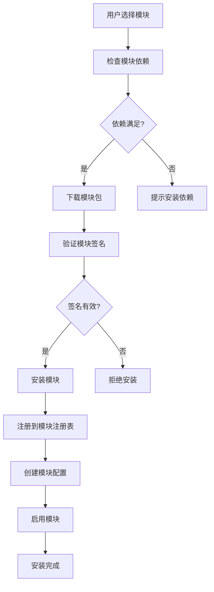
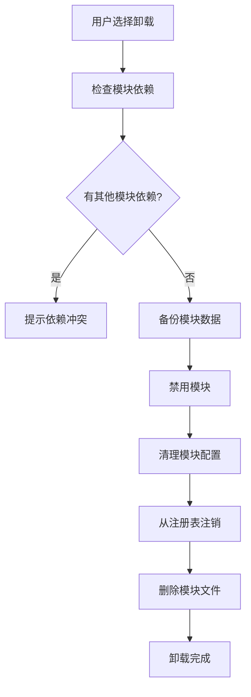
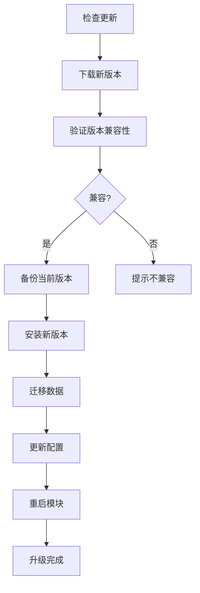

# AINO 模块设计架构文档

## 📋 概述

AINO 平台采用模块化架构设计，支持系统模块和扩展模块的灵活组合。用户模块作为默认系统模块，其他模块可以通过模块市场进行扩展和安装。

## 🏗️ 整体架构设计

### 核心设计理念

1. **模块化架构**：每个功能都是独立的模块，可以单独开发、部署和管理
2. **系统模块 + 扩展模块**：系统模块提供基础功能，扩展模块提供业务功能
3. **应用隔离**：每个应用的模块完全独立，通过 `applicationId` 隔离
4. **统一路由系统**：通过 `/api/modules/system/:moduleKey/*` 和 `/api/modules/:moduleKey/*` 统一访问

### 架构层次

```
┌─────────────────────────────────────────────────────────────┐
│                    AINO 平台架构                              │
├─────────────────────────────────────────────────────────────┤
│  前端层 (AINO-studio)                                        │
│  ├── 模块管理界面                                            │
│  ├── 模块配置界面                                            │
│  └── 模块使用界面                                            │
├─────────────────────────────────────────────────────────────┤
│  API 路由层                                                  │
│  ├── /api/modules/system/* (系统模块)                       │
│  ├── /api/modules/* (扩展模块)                              │
│  └── /api/application-users/* (应用用户)                    │
├─────────────────────────────────────────────────────────────┤
│  模块注册表 (ModuleRegistry)                                │
│  ├── 本地模块注册                                            │
│  ├── 远程模块注册                                            │
│  └── 模块路由管理                                            │
├─────────────────────────────────────────────────────────────┤
│  业务服务层                                                  │
│  ├── 系统模块服务                                            │
│  ├── 扩展模块服务                                            │
│  └── 应用用户服务                                            │
├─────────────────────────────────────────────────────────────┤
│  数据访问层                                                  │
│  ├── 系统模块数据                                            │
│  ├── 扩展模块数据                                            │
│  └── 应用用户数据                                            │
├─────────────────────────────────────────────────────────────┤
│  数据库层 (PostgreSQL)                                       │
│  ├── 系统表 (users, applications, modules)                  │
│  ├── 应用表 (application_users, directories, fields)        │
│  └── 模块表 (relation_records, audit_logs)                  │
└─────────────────────────────────────────────────────────────┘
```

## 🔧 系统模块设计

### 系统模块特性

- **自动包含**：每个应用创建时自动包含所有系统模块
- **不可卸载**：系统模块是平台基础功能，不能卸载
- **统一配置**：通过 `system-modules.ts` 统一管理系统模块配置
- **标准化路由**：通过 `/api/modules/system/:moduleKey/*` 统一路由

### 系统模块列表

#### 1. 用户模块 (`user`)

**功能描述**：应用内用户管理，支持用户注册、登录、权限管理

**数据库设计**：
```sql
-- 应用用户表
CREATE TABLE application_users (
  id UUID PRIMARY KEY DEFAULT gen_random_uuid(),
  application_id UUID NOT NULL REFERENCES applications(id) ON DELETE CASCADE,
  name TEXT NOT NULL,
  email TEXT NOT NULL,
  phone TEXT,
  avatar TEXT,
  status TEXT DEFAULT 'active' NOT NULL, -- active, inactive, pending
  role TEXT DEFAULT 'user' NOT NULL, -- admin, user, guest
  department TEXT,
  position TEXT,
  tags TEXT[] DEFAULT '{}',
  metadata JSONB DEFAULT '{}', -- 扩展字段
  last_login_at TIMESTAMP,
  created_at TIMESTAMP DEFAULT NOW() NOT NULL,
  updated_at TIMESTAMP DEFAULT NOW() NOT NULL
);
```

**API 接口**：
- `GET /api/modules/system/user` - 获取用户列表
- `POST /api/modules/system/user` - 创建用户
- `PUT /api/modules/system/user/:id` - 更新用户
- `DELETE /api/modules/system/user/:id` - 删除用户

**配置选项**：
```typescript
{
  allowRegistration: boolean,        // 是否允许注册
  requireEmailVerification: boolean, // 是否需要邮箱验证
  defaultRole: string,              // 默认角色
  passwordPolicy: {                 // 密码策略
    minLength: number,
    requireUppercase: boolean,
    requireLowercase: boolean,
    requireNumbers: boolean,
    requireSpecialChars: boolean,
  }
}
```

#### 2. 配置模块 (`config`)

**功能描述**：应用基础配置管理

**API 接口**：
- `GET /api/modules/system/config` - 获取系统配置
- `PUT /api/modules/system/config` - 更新系统配置

**配置内容**：
- 应用名称、描述、主题、语言
- 功能开关配置
- 业务规则配置

#### 3. 审计模块 (`audit`)

**功能描述**：记录用户操作和系统事件

**数据库设计**：
```sql
-- 审计日志表
CREATE TABLE audit_logs (
  id UUID PRIMARY KEY DEFAULT gen_random_uuid(),
  application_id UUID NOT NULL REFERENCES applications(id) ON DELETE CASCADE,
  user_id UUID,
  action TEXT NOT NULL,
  resource_type TEXT,
  resource_id TEXT,
  details JSONB,
  ip_address TEXT,
  user_agent TEXT,
  created_at TIMESTAMP DEFAULT NOW() NOT NULL
);
```

**API 接口**：
- `GET /api/modules/system/audit/logs` - 获取审计日志
- `POST /api/modules/system/audit/logs` - 创建审计日志

## 🚀 扩展模块设计

### 扩展模块特性

- **可插拔**：支持动态安装和卸载
- **模块市场**：通过模块市场发布和安装
- **本地/远程**：支持本地模块和远程模块
- **版本管理**：支持模块版本管理和升级

### 模块类型

#### 1. 本地模块 (`local`)

**特点**：
- 与主应用部署在同一服务器
- 直接访问数据库和共享资源
- 性能更好，延迟更低
- 适合核心业务模块

**实现方式**：
```typescript
// 本地模块实现
export const localModule = {
  key: 'ecommerce',
  name: '电商模块',
  version: '1.0.0',
  kind: 'local',
  routes: [
    { method: 'GET', path: '/products', description: '获取商品列表' },
    { method: 'POST', path: '/products', description: '创建商品' },
  ],
  description: '电商业务模块，包含商品、订单、支付等功能',
}
```

#### 2. 远程模块 (`remote`)

**特点**：
- 部署在独立的服务器上
- 通过 HTTP API 调用
- 支持跨语言开发
- 适合第三方集成模块

**实现方式**：
```typescript
// 远程模块配置
export const remoteModule = {
  key: 'payment',
  name: '支付模块',
  version: '1.0.0',
  kind: 'remote',
  baseUrl: 'https://payment.example.com',
  hmacSecret: 'your-secret-key',
  routes: [
    { method: 'POST', path: '/pay', description: '发起支付' },
    { method: 'GET', path: '/status/:id', description: '查询支付状态' },
  ],
  description: '第三方支付模块',
}
```

### 模块注册表 (ModuleRegistry)

**功能**：
- 模块注册和注销
- 模块路由管理
- 本地/远程模块区分
- 模块版本管理

**核心方法**：
```typescript
class ModuleRegistry {
  // 注册模块
  register(manifest: TModuleManifest): void
  
  // 获取模块
  get(key: string): TModuleManifest | undefined
  
  // 获取所有模块
  getAll(): TModuleManifest[]
  
  // 获取本地模块
  getLocalModules(): TModuleManifest[]
  
  // 获取远程模块
  getRemoteModules(): TModuleManifest[]
  
  // 检查模块是否存在
  has(key: string): boolean
  
  // 注销模块
  unregister(key: string): boolean
}
```

## 📊 数据库设计

### 核心表结构

#### 1. 应用表 (`applications`)
```sql
CREATE TABLE applications (
  id UUID PRIMARY KEY DEFAULT gen_random_uuid(),
  name TEXT NOT NULL,
  description TEXT,
  owner_id UUID NOT NULL REFERENCES users(id),
  status TEXT DEFAULT 'active' NOT NULL,
  config JSONB DEFAULT '{}',
  created_at TIMESTAMP DEFAULT NOW() NOT NULL,
  updated_at TIMESTAMP DEFAULT NOW() NOT NULL
);
```

#### 2. 模块表 (`modules`)
```sql
CREATE TABLE modules (
  id UUID PRIMARY KEY DEFAULT gen_random_uuid(),
  application_id UUID NOT NULL REFERENCES applications(id) ON DELETE CASCADE,
  name TEXT NOT NULL,
  type TEXT NOT NULL, -- system, ecom, edu, content, project, custom
  icon TEXT,
  config JSONB DEFAULT '{}',
  order INTEGER DEFAULT 0,
  is_enabled BOOLEAN DEFAULT true,
  created_at TIMESTAMP DEFAULT NOW() NOT NULL,
  updated_at TIMESTAMP DEFAULT NOW() NOT NULL
);
```

#### 3. 目录表 (`directories`)
```sql
CREATE TABLE directories (
  id UUID PRIMARY KEY DEFAULT gen_random_uuid(),
  application_id UUID NOT NULL REFERENCES applications(id) ON DELETE CASCADE,
  module_id UUID REFERENCES modules(id) ON DELETE CASCADE,
  name TEXT NOT NULL,
  slug TEXT NOT NULL,
  description TEXT,
  type TEXT DEFAULT 'table' NOT NULL, -- table, form, workflow
  config JSONB DEFAULT '{}',
  order INTEGER DEFAULT 0,
  is_enabled BOOLEAN DEFAULT true,
  created_at TIMESTAMP DEFAULT NOW() NOT NULL,
  updated_at TIMESTAMP DEFAULT NOW() NOT NULL
);
```

## 🔄 模块生命周期

### 1. 模块安装



### 2. 模块卸载



### 3. 模块升级



## 🛡️ 安全设计

### 1. 模块签名验证

```typescript
// 模块签名验证
export function verifyModuleSignature(
  moduleData: Buffer,
  signature: string,
  publicKey: string
): boolean {
  // 使用公钥验证模块签名
  // 确保模块来源可信
}
```

### 2. 权限隔离

```typescript
// 模块权限检查
export function checkModulePermission(
  moduleKey: string,
  userId: string,
  action: string
): boolean {
  // 检查用户是否有权限访问指定模块的指定操作
}
```

### 3. 数据隔离

```sql
-- 行级安全策略
ALTER TABLE application_users ENABLE ROW LEVEL SECURITY;

CREATE POLICY p_users_by_application ON application_users
  USING (application_id = current_setting('app.application_id')::uuid);
```

## 📈 性能优化

### 1. 模块缓存

```typescript
// 模块缓存机制
class ModuleCache {
  private cache = new Map<string, any>();
  
  get(key: string): any {
    return this.cache.get(key);
  }
  
  set(key: string, value: any, ttl: number = 300000): void {
    this.cache.set(key, value);
    setTimeout(() => this.cache.delete(key), ttl);
  }
}
```

### 2. 懒加载

```typescript
// 模块懒加载
export async function loadModule(moduleKey: string): Promise<Module> {
  if (!moduleCache.has(moduleKey)) {
    const module = await import(`./modules/${moduleKey}`);
    moduleCache.set(moduleKey, module);
  }
  return moduleCache.get(moduleKey);
}
```

### 3. 连接池

```typescript
// 数据库连接池
export const dbPool = new Pool({
  host: process.env.DB_HOST,
  port: parseInt(process.env.DB_PORT || '5432'),
  database: process.env.DB_NAME,
  user: process.env.DB_USER,
  password: process.env.DB_PASSWORD,
  max: 20, // 最大连接数
  idleTimeoutMillis: 30000,
  connectionTimeoutMillis: 2000,
});
```

## 🎯 模块市场设计

### 1. 模块发布

```typescript
// 模块发布流程
export interface ModulePackage {
  manifest: TModuleManifest;
  files: Buffer[];
  signature: string;
  dependencies: string[];
  metadata: {
    author: string;
    homepage: string;
    license: string;
    tags: string[];
  };
}
```

### 2. 模块搜索

```typescript
// 模块搜索功能
export interface ModuleSearchParams {
  keyword?: string;
  category?: string;
  tags?: string[];
  author?: string;
  minRating?: number;
  sortBy?: 'popularity' | 'rating' | 'date' | 'name';
  sortOrder?: 'asc' | 'desc';
}
```

### 3. 模块评分

```typescript
// 模块评分系统
export interface ModuleRating {
  moduleKey: string;
  userId: string;
  rating: number; // 1-5
  review: string;
  createdAt: Date;
}
```

## 📋 开发指南

### 1. 创建本地模块

```typescript
// 1. 创建模块目录
mkdir src/modules/my-module

// 2. 实现模块服务
export class MyModuleService {
  async getData(): Promise<any> {
    // 模块业务逻辑
  }
}

// 3. 注册模块路由
app.get('/api/modules/my-module/data', async (c) => {
  const service = new MyModuleService();
  const data = await service.getData();
  return c.json({ success: true, data });
});

// 4. 注册到模块注册表
moduleRegistry.register({
  key: 'my-module',
  name: '我的模块',
  version: '1.0.0',
  kind: 'local',
  routes: [
    { method: 'GET', path: '/data', description: '获取数据' },
  ],
  description: '我的自定义模块',
});
```

### 2. 创建远程模块

```typescript
// 1. 创建独立的服务
const app = new Hono();

app.get('/data', async (c) => {
  // 远程模块业务逻辑
  return c.json({ success: true, data: 'remote data' });
});

// 2. 配置模块Manifest
export const manifest = {
  key: 'remote-module',
  name: '远程模块',
  version: '1.0.0',
  kind: 'remote',
  baseUrl: 'https://my-module.example.com',
  routes: [
    { method: 'GET', path: '/data', description: '获取远程数据' },
  ],
  description: '远程模块示例',
};

// 3. 在主应用中注册
moduleRegistry.register(manifest);
```

## 🎯 总结

AINO 模块设计架构具有以下特点：

### ✅ 优势

1. **模块化架构**：每个功能都是独立模块，便于开发和维护
2. **灵活扩展**：支持本地和远程模块，满足不同场景需求
3. **应用隔离**：每个应用的模块完全独立，保证数据安全
4. **统一管理**：通过模块注册表统一管理所有模块
5. **版本控制**：支持模块版本管理和升级
6. **安全可靠**：模块签名验证和权限隔离保证安全

### 🚀 未来规划

1. **模块市场**：建设完整的模块生态系统
2. **AI 增强**：集成 AI 能力，提供智能模块推荐
3. **可视化开发**：提供模块可视化开发工具
4. **性能优化**：持续优化模块加载和运行性能
5. **生态建设**：建立开发者社区和模块生态

这个模块化架构为 AINO 平台提供了强大的扩展能力，能够满足各种复杂的业务场景需求，同时保持系统的稳定性和可维护性。
