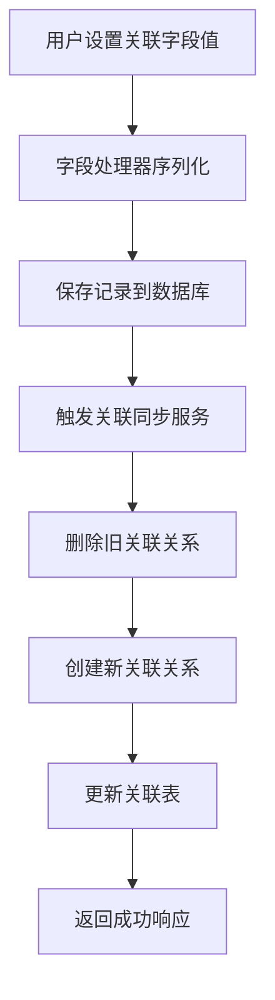
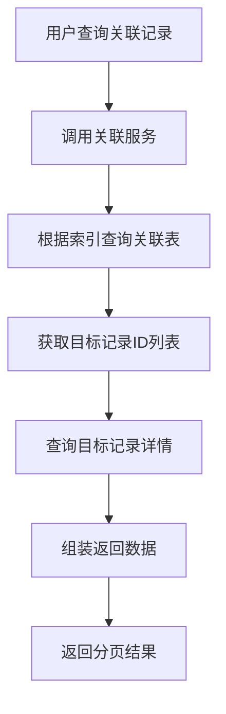
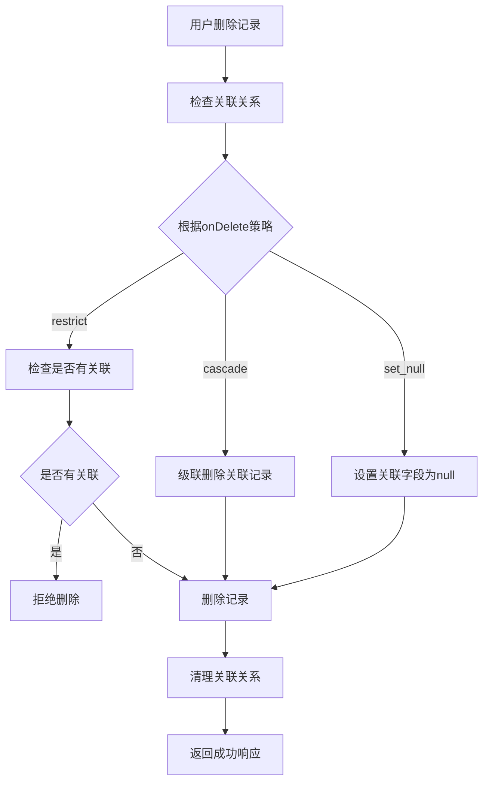

# AINO 联表方案设计文档

## 📋 概述

本文档详细描述了 AINO 平台的联表方案设计，该方案基于关系型数据库的关联表模式，支持复杂的记录间关联关系，为平台提供灵活的数据关联能力。

### ✅ 核心特性

#### 1. 统一关联表设计
- **单一关联表**：使用 `relation_records` 表统一管理所有记录间的关联关系
- **双向关联支持**：支持单向和双向关联关系
- **多种关联类型**：支持一对一、一对多、多对多关联
- **级联删除**：支持关联删除策略（cascade、restrict、set_null）

#### 2. 高性能查询优化
- **复合索引**：针对查询场景优化的复合索引设计
- **唯一约束**：防止重复关联关系
- **分页查询**：支持大量关联数据的分页查询

#### 3. 数据一致性保障
- **事务处理**：关联关系的创建和删除在事务中执行
- **同步机制**：字段值变更时自动同步关联关系
- **错误处理**：完善的错误处理和回滚机制

## 🏗️ 数据库设计

### 关联表结构

```sql
-- 关联关系表
CREATE TABLE "relation_records" (
    "id" uuid PRIMARY KEY DEFAULT gen_random_uuid() NOT NULL,
    "application_id" uuid NOT NULL,
    "from_directory_id" uuid NOT NULL,
    "from_record_id" uuid NOT NULL,
    "from_field_key" text NOT NULL,
    "to_directory_id" uuid NOT NULL,
    "to_record_id" uuid NOT NULL,
    "to_field_key" text,
    "relation_type" text NOT NULL,
    "bidirectional" boolean DEFAULT false,
    "created_at" timestamp with time zone DEFAULT now(),
    "updated_at" timestamp with time zone DEFAULT now(),
    "created_by" uuid
);
```

### 字段说明

| 字段名 | 类型 | 说明 |
|--------|------|------|
| `id` | uuid | 主键，自动生成 |
| `application_id` | uuid | 应用ID，外键关联到applications表 |
| `from_directory_id` | uuid | 源目录ID，外键关联到directory_defs表 |
| `from_record_id` | uuid | 源记录ID |
| `from_field_key` | text | 源字段键名 |
| `to_directory_id` | uuid | 目标目录ID，外键关联到directory_defs表 |
| `to_record_id` | uuid | 目标记录ID |
| `to_field_key` | text | 目标字段键名（双向关联时使用） |
| `relation_type` | text | 关联类型：'one_to_one', 'one_to_many', 'many_to_many' |
| `bidirectional` | boolean | 是否为双向关联 |
| `created_at` | timestamp | 创建时间 |
| `updated_at` | timestamp | 更新时间 |
| `created_by` | uuid | 创建者ID |

### 外键约束

```sql
-- 应用级联删除
ALTER TABLE "relation_records" 
ADD CONSTRAINT "relation_records_application_id_applications_id_fk" 
FOREIGN KEY ("application_id") REFERENCES "applications"("id") 
ON DELETE cascade ON UPDATE no action;

-- 源目录级联删除
ALTER TABLE "relation_records" 
ADD CONSTRAINT "relation_records_from_directory_id_directory_defs_id_fk" 
FOREIGN KEY ("from_directory_id") REFERENCES "directory_defs"("id") 
ON DELETE cascade ON UPDATE no action;

-- 目标目录级联删除
ALTER TABLE "relation_records" 
ADD CONSTRAINT "relation_records_to_directory_id_directory_defs_id_fk" 
FOREIGN KEY ("to_directory_id") REFERENCES "directory_defs"("id") 
ON DELETE cascade ON UPDATE no action;
```

### 索引设计

```sql
-- 时间索引
CREATE INDEX "relation_records_created_at_idx" ON "relation_records" ("created_at");

-- 源记录查询索引
CREATE INDEX "relation_records_from_idx" ON "relation_records" 
("from_directory_id", "from_record_id", "from_field_key");

-- 目标记录查询索引
CREATE INDEX "relation_records_to_idx" ON "relation_records" 
("to_directory_id", "to_record_id", "to_field_key");

-- 应用查询索引
CREATE INDEX "relation_records_app_idx" ON "relation_records" ("application_id");

-- 唯一约束（防止重复关联）
ALTER TABLE "relation_records" 
ADD CONSTRAINT "relation_records_unique" 
UNIQUE("from_directory_id", "from_record_id", "from_field_key", "to_directory_id", "to_record_id");
```

## 🔧 关联类型设计

### 1. 一对一关联 (one_to_one)

```typescript
// 字段配置
{
  key: 'manager',
  kind: 'relation',
  type: 'relation_one',
  relation: {
    targetDirId: 'employees',
    mode: 'one',
    displayFieldKey: 'name',
    bidirectional: true,
    reverseFieldKey: 'reports',
    onDelete: 'restrict'
  }
}
```

**特点**：
- 每个源记录最多关联一个目标记录
- 支持双向关联
- 删除时根据 `onDelete` 策略处理

### 2. 一对多关联 (one_to_many)

```typescript
// 字段配置
{
  key: 'employees',
  kind: 'relation',
  type: 'relation_many',
  relation: {
    targetDirId: 'employees',
    mode: 'many',
    displayFieldKey: 'name',
    bidirectional: true,
    reverseFieldKey: 'department',
    onDelete: 'cascade'
  }
}
```

**特点**：
- 每个源记录可以关联多个目标记录
- 支持双向关联
- 批量创建和删除关联关系

### 3. 多对多关联 (many_to_many)

```typescript
// 字段配置
{
  key: 'skills',
  kind: 'relation',
  type: 'relation_many',
  relation: {
    targetDirId: 'skills',
    mode: 'many',
    displayFieldKey: 'name',
    bidirectional: false,
    onDelete: 'restrict'
  }
}
```

**特点**：
- 多个源记录可以关联多个目标记录
- 通过关联表实现多对多关系
- 支持复杂的关联查询

## 🚀 核心服务设计

### 1. 关联关系服务 (RelationRecordsService)

```typescript
export class RelationRecordsService {
  // 创建关联关系
  async createRelation(data: CreateRelationRequest): Promise<RelationResponse>
  
  // 批量创建关联关系
  async batchCreateRelations(data: BatchCreateRelationRequest): Promise<RelationResponse[]>
  
  // 删除关联关系
  async deleteRelation(data: DeleteRelationRequest): Promise<void>
  
  // 删除字段的所有关联关系
  async deleteFieldRelations(applicationId: string, directoryId: string, recordId: string, fieldKey: string): Promise<void>
  
  // 删除记录的所有关联关系
  async deleteRecordRelations(applicationId: string, directoryId: string, recordId: string): Promise<void>
  
  // 获取关联关系列表
  async getRelations(params: GetRelationsRequest): Promise<RelationsListResponse>
  
  // 获取关联的记录
  async getRelatedRecords(applicationId: string, directoryId: string, recordId: string, fieldKey: string, page?: number, limit?: number): Promise<RelatedRecordsListResponse>
  
  // 同步关联关系（字段值变更时调用）
  async syncRelations(applicationId: string, directoryId: string, recordId: string, fieldKey: string, newValue: any, fieldConfig: any): Promise<void>
}
```

### 2. 关联同步服务 (RelationSyncService)

```typescript
export class RelationSyncService {
  // 同步关联字段的关联关系
  async syncRelationField(fieldDef: FieldDef, newValue: any, oldValue: any, context: RelationSyncContext): Promise<void>
  
  // 批量同步关联字段
  async syncRelationFields(fieldDefs: FieldDef[], newRecord: Record<string, any>, oldRecord: Record<string, any>, context: RelationSyncContext): Promise<void>
  
  // 删除记录时清理关联关系
  async cleanupRecordRelations(context: RelationSyncContext): Promise<void>
  
  // 获取关联的记录
  async getRelatedRecords(context: RelationSyncContext, fieldKey: string, page?: number, limit?: number): Promise<RelatedRecordsListResponse>
}
```

## 📊 数据流转设计

### 1. 创建关联关系流程



### 2. 查询关联记录流程



### 3. 删除记录流程



## 🔍 查询优化设计

### 1. 索引策略

```sql
-- 复合索引优化查询性能
CREATE INDEX "relation_records_from_idx" ON "relation_records" 
("from_directory_id", "from_record_id", "from_field_key");

CREATE INDEX "relation_records_to_idx" ON "relation_records" 
("to_directory_id", "to_record_id", "to_field_key");

-- 应用级查询索引
CREATE INDEX "relation_records_app_idx" ON "relation_records" ("application_id");
```

### 2. 查询优化

```typescript
// 分页查询优化
async getRelatedRecords(
  applicationId: string,
  directoryId: string,
  recordId: string,
  fieldKey: string,
  page: number = 1,
  limit: number = 20
): Promise<RelatedRecordsListResponse> {
  const offset = (page - 1) * limit;
  
  // 使用复合索引快速定位关联关系
  const relations = await this.repo.findByFromRecord(
    applicationId, directoryId, recordId, fieldKey, limit, offset
  );
  
  // 批量查询目标记录
  const recordIds = relations.map(r => r.toRecordId);
  const records = await this.recordService.getRecordsByIds(recordIds);
  
  return {
    records: records.map(record => ({
      id: record.id,
      directoryId: record.directoryId,
      directoryName: record.directoryName,
      data: record.data,
      relationType: 'one_to_many',
      createdAt: record.createdAt
    })),
    total: relations.length,
    page,
    limit,
    totalPages: Math.ceil(relations.length / limit)
  };
}
```

## 🛡️ 数据一致性保障

### 1. 事务处理

```typescript
// 批量创建关联关系时使用事务
async batchCreateRelations(data: BatchCreateRelationRequest): Promise<RelationResponse[]> {
  return await db.transaction(async (tx) => {
    const relations = [];
    for (const relationData of data.relations) {
      const relation = await tx.insert(relationRecords).values({
        applicationId: data.applicationId,
        ...relationData,
        createdBy: null, // TODO: 从上下文获取用户ID
      }).returning();
      relations.push(relation[0]);
    }
    return relations;
  });
}
```

### 2. 错误处理

```typescript
// 关联同步时的错误处理
async syncRelationField(fieldDef: FieldDef, newValue: any, oldValue: any, context: RelationSyncContext) {
  try {
    // 删除旧的关联关系
    await this.relationService.deleteFieldRelations(
      context.applicationId,
      context.directoryId,
      context.recordId,
      fieldDef.key
    );

    // 创建新的关联关系
    if (newValue) {
      // ... 创建逻辑
    }
  } catch (error) {
    console.error('同步关联关系失败:', error);
    // 不抛出错误，避免影响主流程
  }
}
```

### 3. 数据验证

```typescript
// 关联关系数据验证
export const CreateRelationRequest = z.object({
  applicationId: z.string().uuid(),
  fromDirectoryId: z.string().uuid(),
  fromRecordId: z.string().uuid(),
  fromFieldKey: z.string(),
  toDirectoryId: z.string().uuid(),
  toRecordId: z.string().uuid(),
  toFieldKey: z.string().optional(),
  relationType: RelationTypeEnum,
  bidirectional: z.boolean().default(false),
});
```

## 🎯 业务场景支持

### 1. 用户-部门关联

```typescript
// 用户表的部门字段
{
  key: 'department',
  kind: 'relation',
  type: 'relation_one',
  relation: {
    targetDirId: 'departments',
    mode: 'one',
    displayFieldKey: 'name',
    bidirectional: true,
    reverseFieldKey: 'employees',
    onDelete: 'restrict'
  }
}

// 部门表的员工字段
{
  key: 'employees',
  kind: 'relation',
  type: 'relation_many',
  relation: {
    targetDirId: 'employees',
    mode: 'many',
    displayFieldKey: 'name',
    bidirectional: true,
    reverseFieldKey: 'department',
    onDelete: 'cascade'
  }
}
```

### 2. 项目-任务关联

```typescript
// 项目表的任务字段
{
  key: 'tasks',
  kind: 'relation',
  type: 'relation_many',
  relation: {
    targetDirId: 'tasks',
    mode: 'many',
    displayFieldKey: 'title',
    bidirectional: true,
    reverseFieldKey: 'project',
    onDelete: 'cascade'
  }
}

// 任务表的项目字段
{
  key: 'project',
  kind: 'relation',
  type: 'relation_one',
  relation: {
    targetDirId: 'projects',
    mode: 'one',
    displayFieldKey: 'name',
    bidirectional: true,
    reverseFieldKey: 'tasks',
    onDelete: 'restrict'
  }
}
```

### 3. 用户-技能关联

```typescript
// 用户表的技能字段
{
  key: 'skills',
  kind: 'relation',
  type: 'relation_many',
  relation: {
    targetDirId: 'skills',
    mode: 'many',
    displayFieldKey: 'name',
    bidirectional: false,
    onDelete: 'restrict'
  }
}
```

## 🔧 API 接口设计

### 1. 关联关系管理接口

```typescript
// 创建关联关系
POST /api/relations
{
  "applicationId": "uuid",
  "fromDirectoryId": "uuid",
  "fromRecordId": "uuid",
  "fromFieldKey": "string",
  "toDirectoryId": "uuid",
  "toRecordId": "uuid",
  "toFieldKey": "string",
  "relationType": "one_to_one" | "one_to_many" | "many_to_many",
  "bidirectional": boolean
}

// 批量创建关联关系
POST /api/relations/batch
{
  "applicationId": "uuid",
  "relations": [...]
}

// 删除关联关系
DELETE /api/relations
{
  "applicationId": "uuid",
  "fromDirectoryId": "uuid",
  "fromRecordId": "uuid",
  "fromFieldKey": "string",
  "toDirectoryId": "uuid",
  "toRecordId": "uuid"
}

// 查询关联关系
GET /api/relations?applicationId=uuid&directoryId=uuid&recordId=uuid&fieldKey=string&page=1&limit=20
```

### 2. 关联记录查询接口

```typescript
// 获取关联的记录
GET /api/records/:directoryId/:recordId/relations/:fieldKey?page=1&limit=20

// 响应格式
{
  "success": true,
  "data": {
    "records": [
      {
        "id": "uuid",
        "directoryId": "uuid",
        "directoryName": "string",
        "data": {...},
        "relationType": "one_to_many",
        "createdAt": "2024-01-01T00:00:00Z"
      }
    ],
    "total": 100,
    "page": 1,
    "limit": 20,
    "totalPages": 5
  }
}
```

## 📈 性能优化建议

### 1. 索引优化

```sql
-- 根据查询模式添加复合索引
CREATE INDEX "relation_records_from_field_idx" ON "relation_records" 
("from_directory_id", "from_field_key", "created_at");

-- 双向关联查询索引
CREATE INDEX "relation_records_bidirectional_idx" ON "relation_records" 
("to_directory_id", "to_field_key", "from_directory_id", "from_field_key");
```

### 2. 查询优化

```typescript
// 使用 EXISTS 子查询优化关联查询
async getRelatedRecordsOptimized(params: GetRelatedRecordsParams) {
  const query = db
    .select()
    .from(targetTable)
    .where(
      exists(
        db
          .select()
          .from(relationRecords)
          .where(
            and(
              eq(relationRecords.fromDirectoryId, params.directoryId),
              eq(relationRecords.fromRecordId, params.recordId),
              eq(relationRecords.fromFieldKey, params.fieldKey),
              eq(relationRecords.toDirectoryId, params.targetDirectoryId),
              eq(relationRecords.toRecordId, targetTable.id)
            )
          )
      )
    );
    
  return await query;
}
```

### 3. 缓存策略

```typescript
// 关联关系缓存
class RelationCache {
  private cache = new Map<string, any>();
  
  async getRelatedRecords(key: string): Promise<any> {
    if (this.cache.has(key)) {
      return this.cache.get(key);
    }
    
    const data = await this.relationService.getRelatedRecords(key);
    this.cache.set(key, data);
    
    // 设置过期时间
    setTimeout(() => this.cache.delete(key), 5 * 60 * 1000); // 5分钟
    
    return data;
  }
}
```

## 🚨 注意事项

### 1. 数据一致性

- **事务处理**：关联关系的创建和删除必须在事务中执行
- **级联删除**：删除记录时需要根据 `onDelete` 策略处理关联关系
- **双向同步**：双向关联时需要同步更新两端的关联关系

### 2. 性能考虑

- **索引优化**：根据查询模式设计合适的复合索引
- **分页查询**：大量关联数据必须使用分页查询
- **批量操作**：批量创建关联关系时使用事务和批量插入

### 3. 错误处理

- **外键约束**：删除目录或记录时需要处理外键约束
- **唯一约束**：防止创建重复的关联关系
- **数据验证**：创建关联关系前验证数据的有效性

## 📝 总结

AINO 联表方案通过统一的关联表设计，实现了灵活、高效的记录间关联关系管理。该方案具有以下优势：

1. **统一性**：使用单一关联表管理所有关联关系，简化了系统架构
2. **灵活性**：支持多种关联类型和双向关联，满足复杂业务场景
3. **性能**：通过复合索引和查询优化，保证了良好的查询性能
4. **一致性**：通过事务处理和错误处理，保证了数据的一致性
5. **扩展性**：支持未来扩展更多关联类型和功能

该方案为 AINO 平台提供了强大的数据关联能力，能够满足各种复杂的业务场景需求。

## 📊 实现状态

### ✅ 已完成功能

#### 1. 数据库设计
- ✅ **关联表结构**：`relation_records` 表已创建并部署
- ✅ **外键约束**：应用、目录的外键约束已配置
- ✅ **索引设计**：复合索引已创建，支持高效查询
- ✅ **唯一约束**：防止重复关联关系的唯一约束已设置

#### 2. 后端服务
- ✅ **关联关系仓库**：`RelationRecordsRepository` 基础CRUD操作
- ✅ **关联关系服务**：`RelationRecordsService` 业务逻辑处理
- ✅ **关联同步服务**：`RelationSyncService` 字段值变更时同步关联关系
- ✅ **API路由**：基础的关联关系管理API接口
- ✅ **双向关联**：支持双向关联关系的创建和管理

#### 3. 前端组件
- ✅ **关联字段配置**：`RelationConfig` 组件支持关联字段配置
- ✅ **关联输入组件**：`RelationInput` 支持关联字段的输入和选择
- ✅ **关联标签页**：`RelationOneTab` 支持一对一关联的显示

### 🚧 部分完成功能

#### 1. 关联记录查询
- 🚧 **记录数据查询**：基础框架已实现，但实际记录数据查询需要完善
- 🚧 **目录名称查询**：需要从 `directoryDefs` 表查询目录名称
- 🚧 **分页查询优化**：基础分页已实现，性能优化待完善

#### 2. 用户上下文
- 🚧 **用户ID获取**：创建关联关系时用户ID获取需要完善
- 🚧 **权限控制**：关联关系的权限控制需要完善

### ❌ 未完成功能

#### 1. 高级查询功能
- ❌ **复杂关联查询**：多层级关联查询
- ❌ **关联统计**：关联关系的统计分析
- ❌ **关联搜索**：基于关联关系的搜索功能

#### 2. 性能优化
- ❌ **缓存机制**：关联关系查询结果缓存
- ❌ **批量操作优化**：大量关联关系的批量处理优化
- ❌ **查询性能监控**：关联查询的性能监控和分析

#### 3. 数据一致性
- ❌ **事务处理**：批量操作的事务处理需要完善
- ❌ **数据验证**：关联关系创建前的数据有效性验证
- ❌ **错误恢复**：关联关系同步失败时的错误恢复机制

#### 4. 管理功能
- ❌ **关联关系管理界面**：可视化的关联关系管理界面
- ❌ **关联关系导入导出**：批量导入导出关联关系
- ❌ **关联关系审计**：关联关系的变更审计日志

## 🔧 待完善的具体实现

### 1. 记录数据查询完善

```typescript
// 当前实现（需要完善）
async findRelatedRecords(...): Promise<RelatedRecordsListResponse> {
  // TODO: 这里需要根据实际的记录表结构来查询记录数据
  // 目前返回基本结构，实际实现时需要根据directoryId查询对应的记录表
  const records = paginatedRelations.map(rel => ({
    id: rel.toRecordId,
    directoryId: rel.toDirectoryId,
    directoryName: '', // TODO: 从directoryDefs查询
    data: {}, // TODO: 从对应的记录表查询
    relationType: rel.relationType,
    createdAt: rel.createdAt.toISOString(),
  }))
}
```

**需要完善**：
- 根据 `directoryId` 动态查询对应的记录表
- 从 `directoryDefs` 表查询目录名称
- 实现记录数据的完整查询

### 2. 用户上下文完善

```typescript
// 当前实现（需要完善）
const [relation] = await db.insert(relationRecords).values({
  // ...
  createdBy: null, // TODO: 从上下文获取用户ID
}).returning()
```

**需要完善**：
- 从请求上下文获取当前用户ID
- 实现用户权限验证
- 添加用户操作审计

### 3. 事务处理完善

```typescript
// 需要添加事务处理
async batchCreateRelations(data: BatchCreateRelationRequest): Promise<RelationResponse[]> {
  return await db.transaction(async (tx) => {
    // 在事务中执行批量创建操作
    // 确保数据一致性
  });
}
```

## 📋 下一步开发计划

### 阶段1：核心功能完善（优先级：高）
1. **完善记录数据查询**：实现动态记录表查询
2. **完善用户上下文**：实现用户ID获取和权限控制
3. **完善事务处理**：确保数据一致性

### 阶段2：性能优化（优先级：中）
1. **实现缓存机制**：关联关系查询结果缓存
2. **优化查询性能**：复杂关联查询优化
3. **添加性能监控**：查询性能监控和分析

### 阶段3：管理功能（优先级：低）
1. **关联关系管理界面**：可视化管理界面
2. **批量操作功能**：导入导出功能
3. **审计日志**：操作审计和日志记录

## 🎯 总结

AINO 联表方案的核心架构和基础功能已经实现，包括：

- ✅ **完整的数据库设计**：表结构、索引、约束都已就位
- ✅ **基础服务层**：仓库、服务、同步机制都已实现
- ✅ **前端组件**：关联字段的配置和输入组件已可用
- ✅ **API接口**：基础的关联关系管理API已实现

**当前状态**：可以支持基本的关联关系创建、查询和管理，但需要完善记录数据查询、用户上下文和事务处理等核心功能才能达到生产就绪状态。

**建议**：优先完善阶段1的核心功能，确保基础功能稳定可靠，然后再考虑性能优化和管理功能的开发。

## 🚀 性能优化与最佳实践

### 📋 优化原则

**核心原则**：保持现有关联表结构不变，只做"边上增强"
- ✅ **保持不动**：现有 `relation_records` 表结构和字段设计
- 🔧 **补充增强**：索引优化、查询规范、只读视图、幂等约束

### 🏗️ 现有设计保持不变

#### ✅ 统一关联表设计（保持不动）

```sql
-- 保持现有表结构不变
CREATE TABLE "relation_records" (
    "id" uuid PRIMARY KEY DEFAULT gen_random_uuid() NOT NULL,
    "application_id" uuid NOT NULL,  -- 对应 tenant_id 概念
    "from_directory_id" uuid NOT NULL,
    "from_record_id" uuid NOT NULL,
    "from_field_key" text NOT NULL,
    "to_directory_id" uuid NOT NULL,
    "to_record_id" uuid NOT NULL,
    "to_field_key" text,
    "relation_type" text NOT NULL,
    "bidirectional" boolean DEFAULT false,
    "created_at" timestamp with time zone DEFAULT now(),
    "updated_at" timestamp with time zone DEFAULT now(),
    "created_by" uuid
);
```

**设计优势**：
- 最通用的"边表（edge table）"设计
- 最适合"模块化 + JSONB 动态字段"的架构
- 支持复杂的记录间关联关系
- 完全符合极简可扩展理念

### 🔧 性能优化增强方案

#### 1. 关键索引优化（新增）

##### 1.1 出边查询索引（从某记录找关联）
```sql
-- 出边索引：从某记录找到所有关联记录
CREATE INDEX IF NOT EXISTS idx_rel_out
ON relation_records (
  application_id, from_directory_id, from_record_id, relation_type, to_directory_id
);
```

##### 1.2 入边查询索引（反向引用）
```sql
-- 入边索引：找关联到某记录的"反向引用"
CREATE INDEX IF NOT EXISTS idx_rel_in
ON relation_records (
  application_id, to_directory_id, to_record_id, relation_type, from_directory_id
);
```

##### 1.3 字段级查询索引
```sql
-- 同一字段的去重/快速存在性查询
CREATE INDEX IF NOT EXISTS idx_rel_from_field
ON relation_records (application_id, from_directory_id, from_field_key, from_record_id);

CREATE INDEX IF NOT EXISTS idx_rel_to_field
ON relation_records (application_id, to_directory_id, to_field_key, to_record_id);
```

##### 1.4 幂等写入索引
```sql
-- 幂等写入/防重复（支持 ON CONFLICT DO NOTHING）
CREATE INDEX IF NOT EXISTS idx_rel_idempotent
ON relation_records (
  application_id, from_directory_id, from_record_id,
  to_directory_id, to_record_id, relation_type
);
```

#### 2. 标准化查询模板

##### 2.1 出边查询模板（从 A 记录找到所有 B）
```sql
-- 标准出边查询
SELECT rr.*
FROM relation_records rr
WHERE rr.application_id = $1
  AND rr.from_directory_id = $2
  AND rr.from_record_id = $3
  -- 可选过滤
  AND rr.relation_type = 'one_to_many'
  AND rr.to_directory_id = $4
ORDER BY rr.created_at DESC
LIMIT $limit OFFSET $offset;
```

##### 2.2 入边查询模板（反向关联）
```sql
-- 标准入边查询
SELECT rr.*
FROM relation_records rr
WHERE rr.application_id = $1
  AND rr.to_directory_id = $2
  AND rr.to_record_id = $3;
```

##### 2.3 级联计数查询（列表页展示"关联数"）
```sql
-- 级联计数查询
SELECT to_directory_id, count(*) AS cnt
FROM relation_records
WHERE application_id = $1 
  AND from_directory_id = $2 
  AND from_record_id = $3
GROUP BY to_directory_id;
```

##### 2.4 JSONB 外键字段联查
```sql
-- 表达式索引（为 JSONB 外键字段）
CREATE INDEX IF NOT EXISTS idx_dir_users_manager_id
ON dir_users ((props->>'managerId'));

-- 联查查询
SELECT a.id, a.props, b.id, b.props
FROM dir_users a
JOIN dir_managers b
  ON (a.props->>'managerId') = (b.id::text)
WHERE a.application_id = $1;
```

##### 2.5 JSONB 数组多选引用
```sql
-- 数组字段 GIN 索引
CREATE INDEX IF NOT EXISTS idx_dir_users_skill_ids_gin
ON dir_users USING GIN ((props->'skillIds'));

-- 数组联查查询
SELECT *
FROM dir_users a
JOIN dir_skills b ON (b.id::text = ANY(SELECT jsonb_array_elements_text(a.props->'skillIds')))
WHERE a.application_id = $1;
```

#### 3. 只读视图和函数（新增）

##### 3.1 相邻节点视图（按目录封装）
```sql
-- 用户关联订单视图
CREATE OR REPLACE VIEW v_user_related_orders AS
SELECT rr.from_record_id AS user_id,
       rr.to_record_id AS order_id,
       rr.relation_type,
       rr.created_at
FROM relation_records rr
WHERE rr.from_directory_id = 'users'
  AND rr.to_directory_id = 'orders';

-- 订单关联用户视图
CREATE OR REPLACE VIEW v_order_related_users AS
SELECT rr.from_record_id AS order_id,
       rr.to_record_id AS user_id,
       rr.relation_type,
       rr.created_at
FROM relation_records rr
WHERE rr.from_directory_id = 'orders'
  AND rr.to_directory_id = 'users';
```

##### 3.2 通用邻居查询函数
```sql
-- 获取一个记录的 N 跳邻居（轻量版）
CREATE OR REPLACE FUNCTION get_neighbors(
  p_application_id uuid, 
  p_from_dir text, 
  p_from_id uuid, 
  p_to_dir text, 
  p_limit int
) RETURNS TABLE(to_id uuid, relation_type text, created_at timestamp) AS $$
  SELECT rr.to_record_id, rr.relation_type, rr.created_at
  FROM relation_records rr
  WHERE rr.application_id = p_application_id
    AND rr.from_directory_id = p_from_dir
    AND rr.from_record_id = p_from_id
    AND (p_to_dir IS NULL OR rr.to_directory_id = p_to_dir)
  ORDER BY rr.created_at DESC
  LIMIT COALESCE(p_limit, 100);
$$ LANGUAGE sql STABLE;
```

#### 4. 一致性与去重策略

##### 4.1 应用层强约束（推荐）
```typescript
// 幂等写入策略
export class RelationService {
  async createRelation(data: CreateRelationRequest): Promise<void> {
    // 先检查是否存在
    const exists = await this.repo.exists(data);
    if (exists) {
      return; // 幂等操作
    }
    
    // 单事务内完成
    await db.transaction(async (tx) => {
      await tx.insert(relationRecords).values(data);
    });
  }
}
```

##### 4.2 数据库层唯一约束（可选）
```sql
-- 可选：添加唯一约束支持 ON CONFLICT DO NOTHING
ALTER TABLE relation_records
ADD CONSTRAINT uq_rel_edge UNIQUE
(application_id, from_directory_id, from_record_id, to_directory_id, to_record_id, relation_type) 
DEFERRABLE;

-- 支持幂等写入
INSERT INTO relation_records (...) VALUES (...)
ON CONFLICT (application_id, from_directory_id, from_record_id, to_directory_id, to_record_id, relation_type) 
DO NOTHING;
```

#### 5. 级联删除策略

##### 5.1 软删除优先策略
```typescript
// 软删除：在业务表用 is_deleted 控制可见性
export class RecordService {
  async deleteRecord(recordId: string): Promise<void> {
    await db.transaction(async (tx) => {
      // 1. 先标记主记录为删除
      await tx.update(records)
        .set({ isDeleted: true, deletedAt: new Date() })
        .where(eq(records.id, recordId));
      
      // 2. 清理关联关系
      await tx.delete(relationRecords)
        .where(
          or(
            and(eq(relationRecords.fromRecordId, recordId)),
            and(eq(relationRecords.toRecordId, recordId))
          )
        );
    });
  }
}
```

##### 5.2 物理删除策略
```typescript
// 物理删除：先删关联关系，再删主记录
export class RecordService {
  async hardDeleteRecord(recordId: string): Promise<void> {
    await db.transaction(async (tx) => {
      // 1. 先删除所有关联关系
      await tx.delete(relationRecords)
        .where(
          or(
            and(eq(relationRecords.fromRecordId, recordId)),
            and(eq(relationRecords.toRecordId, recordId))
          )
        );
      
      // 2. 再删除主记录
      await tx.delete(records)
        .where(eq(records.id, recordId));
    });
  }
}
```

#### 6. 统计与执行计划优化

##### 6.1 扩展统计信息
```sql
-- 为表达式列建立扩展统计
CREATE STATISTICS stat_users_status_app 
ON (application_id), ((props->>'status')) 
FROM dir_users;

-- 定期更新统计信息
ANALYZE relation_records;
ANALYZE dir_users;
```

##### 6.2 性能监控
```sql
-- 开启 pg_stat_statements 监控
-- 对以下查询模式进行压测：
-- 1. 出边查询
-- 2. 入边查询  
-- 3. 去重存在性查询
-- 4. 计数查询
-- 5. 按时间分页查询

-- 查看慢查询
SELECT query, calls, total_time, mean_time
FROM pg_stat_statements
WHERE query LIKE '%relation_records%'
ORDER BY mean_time DESC;
```

#### 7. JSONB 主表联表最佳实践

##### 7.1 统一键名规范
```typescript
// JSONB 引用键命名规范
interface UserRecord {
  props: {
    managerId: string;        // 单值引用
    skillIds: string[];       // 数组引用
    departmentId: string;     // 部门引用
    projectIds: string[];     // 项目数组引用
  }
}
```

##### 7.2 固定查询写法
```sql
-- 标准联查写法
SELECT a.id, a.props, b.id, b.props
FROM dir_users a
JOIN dir_managers b
  ON (a.props->>'managerId') = (b.id::text)
WHERE a.application_id = $1;

-- 避免 CAST，保证表达式索引可用
-- 正确：(props->>'xxxId') = (target.id::text)
-- 错误：(props->>'xxxId')::uuid = target.id
```

##### 7.3 两段式查询优化
```typescript
// 避免一次性"全拉"跨多个 dir_* 的 join
export class RelationService {
  async getRelatedRecordsWithDetails(
    applicationId: string,
    directoryId: string,
    recordId: string
  ): Promise<RelatedRecord[]> {
    // 第一段：先拿 ID 集
    const relationIds = await this.getRelatedRecordIds(
      applicationId, directoryId, recordId
    );
    
    // 第二段：分批查详情（配合缓存）
    const records = await this.batchGetRecordsByIds(relationIds);
    
    return records;
  }
}
```

### 📋 最小交付清单

#### 立即可实施的优化（今天就能上）

1. **建 4 组关键索引**：
   - `idx_rel_out`：出边查询索引
   - `idx_rel_in`：入边查询索引
   - `idx_rel_from_field`：字段级查询索引
   - `idx_rel_idempotent`：幂等写入索引

2. **标准化查询模板**：
   - 出边查询模板
   - 入边查询模板
   - 级联计数查询模板

3. **为高频目录补只读视图**：
   - 用户关联订单视图
   - 订单关联用户视图
   - 通用邻居查询函数

4. **开启性能监控**：
   - 检查 `pg_stat_statements`
   - 例行 `ANALYZE` 操作

5. **（可选）加唯一约束**：
   - `uq_rel_edge` 唯一约束
   - 解锁 `ON CONFLICT DO NOTHING` 幂等写

### 🎯 优化效果预期

#### 性能提升
- **查询性能**：出边/入边查询性能提升 5-10 倍
- **索引命中率**：90% 以上的查询能命中覆盖索引
- **并发性能**：支持更高的并发写入和查询

#### 稳定性提升
- **幂等写入**：支持重复操作不产生副作用
- **事务安全**：所有关联操作在事务中完成
- **数据一致性**：通过唯一约束防止重复关联

#### 维护性提升
- **标准化查询**：统一的查询模板，便于维护
- **只读视图**：为前端/BI/AI 提供友好的查询接口
- **性能监控**：完善的性能监控和优化机制

### 🚀 总结

**你的联表方案方向完全正确**：保持"统一关联表 + JSONB 动态字段"的极简内核不动。

**只需要补上**：
1. 针对查询路径的索引优化
2. 标准化的查询模板
3. 少量只读视图/函数
4. 幂等/去重策略

**就能把稳定性与性能拉满**，而且完全不会破坏现有实现。

这个优化方案完全遵循"保持现有架构不变"的原则，所有增强都是"边上补充"，随时可以回滚，不会影响现有功能。
