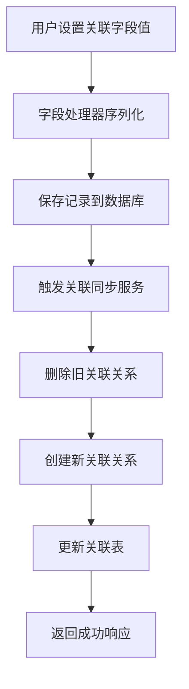
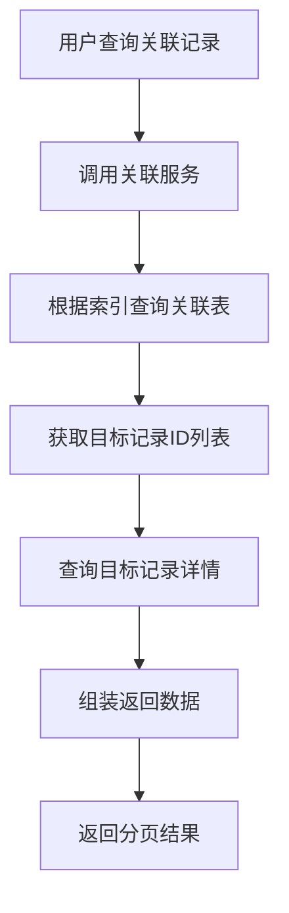
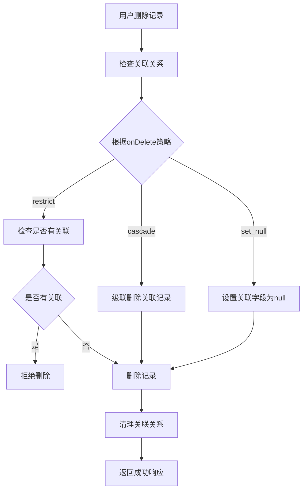

# AINO 联表方案设计文档

## 📋 概述

本文档详细描述了 AINO 平台的联表方案设计，该方案基于关系型数据库的关联表模式，支持复杂的记录间关联关系，为平台提供灵活的数据关联能力。

### ✅ 核心特性

#### 1. 统一关联表设计
- **单一关联表**：使用 `relation_records` 表统一管理所有记录间的关联关系
- **双向关联支持**：支持单向和双向关联关系
- **多种关联类型**：支持一对一、一对多、多对多关联
- **级联删除**：支持关联删除策略（cascade、restrict、set_null）

#### 2. 高性能查询优化
- **复合索引**：针对查询场景优化的复合索引设计
- **唯一约束**：防止重复关联关系
- **分页查询**：支持大量关联数据的分页查询

#### 3. 数据一致性保障
- **事务处理**：关联关系的创建和删除在事务中执行
- **同步机制**：字段值变更时自动同步关联关系
- **错误处理**：完善的错误处理和回滚机制

## 🏗️ 数据库设计

### 关联表结构

```sql
-- 关联关系表
CREATE TABLE "relation_records" (
    "id" uuid PRIMARY KEY DEFAULT gen_random_uuid() NOT NULL,
    "application_id" uuid NOT NULL,
    "from_directory_id" uuid NOT NULL,
    "from_record_id" uuid NOT NULL,
    "from_field_key" text NOT NULL,
    "to_directory_id" uuid NOT NULL,
    "to_record_id" uuid NOT NULL,
    "to_field_key" text,
    "relation_type" text NOT NULL,
    "bidirectional" boolean DEFAULT false,
    "created_at" timestamp with time zone DEFAULT now(),
    "updated_at" timestamp with time zone DEFAULT now(),
    "created_by" uuid
);
```

### 字段说明

| 字段名 | 类型 | 说明 |
|--------|------|------|
| `id` | uuid | 主键，自动生成 |
| `application_id` | uuid | 应用ID，外键关联到applications表 |
| `from_directory_id` | uuid | 源目录ID，外键关联到directory_defs表 |
| `from_record_id` | uuid | 源记录ID |
| `from_field_key` | text | 源字段键名 |
| `to_directory_id` | uuid | 目标目录ID，外键关联到directory_defs表 |
| `to_record_id` | uuid | 目标记录ID |
| `to_field_key` | text | 目标字段键名（双向关联时使用） |
| `relation_type` | text | 关联类型：'one_to_one', 'one_to_many', 'many_to_many' |
| `bidirectional` | boolean | 是否为双向关联 |
| `created_at` | timestamp | 创建时间 |
| `updated_at` | timestamp | 更新时间 |
| `created_by` | uuid | 创建者ID |

### 外键约束

```sql
-- 应用级联删除
ALTER TABLE "relation_records" 
ADD CONSTRAINT "relation_records_application_id_applications_id_fk" 
FOREIGN KEY ("application_id") REFERENCES "applications"("id") 
ON DELETE cascade ON UPDATE no action;

-- 源目录级联删除
ALTER TABLE "relation_records" 
ADD CONSTRAINT "relation_records_from_directory_id_directory_defs_id_fk" 
FOREIGN KEY ("from_directory_id") REFERENCES "directory_defs"("id") 
ON DELETE cascade ON UPDATE no action;

-- 目标目录级联删除
ALTER TABLE "relation_records" 
ADD CONSTRAINT "relation_records_to_directory_id_directory_defs_id_fk" 
FOREIGN KEY ("to_directory_id") REFERENCES "directory_defs"("id") 
ON DELETE cascade ON UPDATE no action;
```

### 索引设计

```sql
-- 时间索引
CREATE INDEX "relation_records_created_at_idx" ON "relation_records" ("created_at");

-- 源记录查询索引
CREATE INDEX "relation_records_from_idx" ON "relation_records" 
("from_directory_id", "from_record_id", "from_field_key");

-- 目标记录查询索引
CREATE INDEX "relation_records_to_idx" ON "relation_records" 
("to_directory_id", "to_record_id", "to_field_key");

-- 应用查询索引
CREATE INDEX "relation_records_app_idx" ON "relation_records" ("application_id");

-- 唯一约束（防止重复关联）
ALTER TABLE "relation_records" 
ADD CONSTRAINT "relation_records_unique" 
UNIQUE("from_directory_id", "from_record_id", "from_field_key", "to_directory_id", "to_record_id");
```

## 🔧 关联类型设计

### 1. 一对一关联 (one_to_one)

```typescript
// 字段配置
{
  key: 'manager',
  kind: 'relation',
  type: 'relation_one',
  relation: {
    targetDirId: 'employees',
    mode: 'one',
    displayFieldKey: 'name',
    bidirectional: true,
    reverseFieldKey: 'reports',
    onDelete: 'restrict'
  }
}
```

**特点**：
- 每个源记录最多关联一个目标记录
- 支持双向关联
- 删除时根据 `onDelete` 策略处理

### 2. 一对多关联 (one_to_many)

```typescript
// 字段配置
{
  key: 'employees',
  kind: 'relation',
  type: 'relation_many',
  relation: {
    targetDirId: 'employees',
    mode: 'many',
    displayFieldKey: 'name',
    bidirectional: true,
    reverseFieldKey: 'department',
    onDelete: 'cascade'
  }
}
```

**特点**：
- 每个源记录可以关联多个目标记录
- 支持双向关联
- 批量创建和删除关联关系

### 3. 多对多关联 (many_to_many)

```typescript
// 字段配置
{
  key: 'skills',
  kind: 'relation',
  type: 'relation_many',
  relation: {
    targetDirId: 'skills',
    mode: 'many',
    displayFieldKey: 'name',
    bidirectional: false,
    onDelete: 'restrict'
  }
}
```

**特点**：
- 多个源记录可以关联多个目标记录
- 通过关联表实现多对多关系
- 支持复杂的关联查询

## 🚀 核心服务设计

### 1. 关联关系服务 (RelationRecordsService)

```typescript
export class RelationRecordsService {
  // 创建关联关系
  async createRelation(data: CreateRelationRequest): Promise<RelationResponse>
  
  // 批量创建关联关系
  async batchCreateRelations(data: BatchCreateRelationRequest): Promise<RelationResponse[]>
  
  // 删除关联关系
  async deleteRelation(data: DeleteRelationRequest): Promise<void>
  
  // 删除字段的所有关联关系
  async deleteFieldRelations(applicationId: string, directoryId: string, recordId: string, fieldKey: string): Promise<void>
  
  // 删除记录的所有关联关系
  async deleteRecordRelations(applicationId: string, directoryId: string, recordId: string): Promise<void>
  
  // 获取关联关系列表
  async getRelations(params: GetRelationsRequest): Promise<RelationsListResponse>
  
  // 获取关联的记录
  async getRelatedRecords(applicationId: string, directoryId: string, recordId: string, fieldKey: string, page?: number, limit?: number): Promise<RelatedRecordsListResponse>
  
  // 同步关联关系（字段值变更时调用）
  async syncRelations(applicationId: string, directoryId: string, recordId: string, fieldKey: string, newValue: any, fieldConfig: any): Promise<void>
}
```

### 2. 关联同步服务 (RelationSyncService)

```typescript
export class RelationSyncService {
  // 同步关联字段的关联关系
  async syncRelationField(fieldDef: FieldDef, newValue: any, oldValue: any, context: RelationSyncContext): Promise<void>
  
  // 批量同步关联字段
  async syncRelationFields(fieldDefs: FieldDef[], newRecord: Record<string, any>, oldRecord: Record<string, any>, context: RelationSyncContext): Promise<void>
  
  // 删除记录时清理关联关系
  async cleanupRecordRelations(context: RelationSyncContext): Promise<void>
  
  // 获取关联的记录
  async getRelatedRecords(context: RelationSyncContext, fieldKey: string, page?: number, limit?: number): Promise<RelatedRecordsListResponse>
}
```

## 📊 数据流转设计

### 1. 创建关联关系流程



### 2. 查询关联记录流程



### 3. 删除记录流程



## 🔍 查询优化设计

### 1. 索引策略

```sql
-- 复合索引优化查询性能
CREATE INDEX "relation_records_from_idx" ON "relation_records" 
("from_directory_id", "from_record_id", "from_field_key");

CREATE INDEX "relation_records_to_idx" ON "relation_records" 
("to_directory_id", "to_record_id", "to_field_key");

-- 应用级查询索引
CREATE INDEX "relation_records_app_idx" ON "relation_records" ("application_id");
```

### 2. 查询优化

```typescript
// 分页查询优化
async getRelatedRecords(
  applicationId: string,
  directoryId: string,
  recordId: string,
  fieldKey: string,
  page: number = 1,
  limit: number = 20
): Promise<RelatedRecordsListResponse> {
  const offset = (page - 1) * limit;
  
  // 使用复合索引快速定位关联关系
  const relations = await this.repo.findByFromRecord(
    applicationId, directoryId, recordId, fieldKey, limit, offset
  );
  
  // 批量查询目标记录
  const recordIds = relations.map(r => r.toRecordId);
  const records = await this.recordService.getRecordsByIds(recordIds);
  
  return {
    records: records.map(record => ({
      id: record.id,
      directoryId: record.directoryId,
      directoryName: record.directoryName,
      data: record.data,
      relationType: 'one_to_many',
      createdAt: record.createdAt
    })),
    total: relations.length,
    page,
    limit,
    totalPages: Math.ceil(relations.length / limit)
  };
}
```

## 🛡️ 数据一致性保障

### 1. 事务处理

```typescript
// 批量创建关联关系时使用事务
async batchCreateRelations(data: BatchCreateRelationRequest): Promise<RelationResponse[]> {
  return await db.transaction(async (tx) => {
    const relations = [];
    for (const relationData of data.relations) {
      const relation = await tx.insert(relationRecords).values({
        applicationId: data.applicationId,
        ...relationData,
        createdBy: null, // TODO: 从上下文获取用户ID
      }).returning();
      relations.push(relation[0]);
    }
    return relations;
  });
}
```

### 2. 错误处理

```typescript
// 关联同步时的错误处理
async syncRelationField(fieldDef: FieldDef, newValue: any, oldValue: any, context: RelationSyncContext) {
  try {
    // 删除旧的关联关系
    await this.relationService.deleteFieldRelations(
      context.applicationId,
      context.directoryId,
      context.recordId,
      fieldDef.key
    );

    // 创建新的关联关系
    if (newValue) {
      // ... 创建逻辑
    }
  } catch (error) {
    console.error('同步关联关系失败:', error);
    // 不抛出错误，避免影响主流程
  }
}
```

### 3. 数据验证

```typescript
// 关联关系数据验证
export const CreateRelationRequest = z.object({
  applicationId: z.string().uuid(),
  fromDirectoryId: z.string().uuid(),
  fromRecordId: z.string().uuid(),
  fromFieldKey: z.string(),
  toDirectoryId: z.string().uuid(),
  toRecordId: z.string().uuid(),
  toFieldKey: z.string().optional(),
  relationType: RelationTypeEnum,
  bidirectional: z.boolean().default(false),
});
```

## 🎯 业务场景支持

### 1. 用户-部门关联

```typescript
// 用户表的部门字段
{
  key: 'department',
  kind: 'relation',
  type: 'relation_one',
  relation: {
    targetDirId: 'departments',
    mode: 'one',
    displayFieldKey: 'name',
    bidirectional: true,
    reverseFieldKey: 'employees',
    onDelete: 'restrict'
  }
}

// 部门表的员工字段
{
  key: 'employees',
  kind: 'relation',
  type: 'relation_many',
  relation: {
    targetDirId: 'employees',
    mode: 'many',
    displayFieldKey: 'name',
    bidirectional: true,
    reverseFieldKey: 'department',
    onDelete: 'cascade'
  }
}
```

### 2. 项目-任务关联

```typescript
// 项目表的任务字段
{
  key: 'tasks',
  kind: 'relation',
  type: 'relation_many',
  relation: {
    targetDirId: 'tasks',
    mode: 'many',
    displayFieldKey: 'title',
    bidirectional: true,
    reverseFieldKey: 'project',
    onDelete: 'cascade'
  }
}

// 任务表的项目字段
{
  key: 'project',
  kind: 'relation',
  type: 'relation_one',
  relation: {
    targetDirId: 'projects',
    mode: 'one',
    displayFieldKey: 'name',
    bidirectional: true,
    reverseFieldKey: 'tasks',
    onDelete: 'restrict'
  }
}
```

### 3. 用户-技能关联

```typescript
// 用户表的技能字段
{
  key: 'skills',
  kind: 'relation',
  type: 'relation_many',
  relation: {
    targetDirId: 'skills',
    mode: 'many',
    displayFieldKey: 'name',
    bidirectional: false,
    onDelete: 'restrict'
  }
}
```

## 🔧 API 接口设计

### 1. 关联关系管理接口

```typescript
// 创建关联关系
POST /api/relations
{
  "applicationId": "uuid",
  "fromDirectoryId": "uuid",
  "fromRecordId": "uuid",
  "fromFieldKey": "string",
  "toDirectoryId": "uuid",
  "toRecordId": "uuid",
  "toFieldKey": "string",
  "relationType": "one_to_one" | "one_to_many" | "many_to_many",
  "bidirectional": boolean
}

// 批量创建关联关系
POST /api/relations/batch
{
  "applicationId": "uuid",
  "relations": [...]
}

// 删除关联关系
DELETE /api/relations
{
  "applicationId": "uuid",
  "fromDirectoryId": "uuid",
  "fromRecordId": "uuid",
  "fromFieldKey": "string",
  "toDirectoryId": "uuid",
  "toRecordId": "uuid"
}

// 查询关联关系
GET /api/relations?applicationId=uuid&directoryId=uuid&recordId=uuid&fieldKey=string&page=1&limit=20
```

### 2. 关联记录查询接口

```typescript
// 获取关联的记录
GET /api/records/:directoryId/:recordId/relations/:fieldKey?page=1&limit=20

// 响应格式
{
  "success": true,
  "data": {
    "records": [
      {
        "id": "uuid",
        "directoryId": "uuid",
        "directoryName": "string",
        "data": {...},
        "relationType": "one_to_many",
        "createdAt": "2024-01-01T00:00:00Z"
      }
    ],
    "total": 100,
    "page": 1,
    "limit": 20,
    "totalPages": 5
  }
}
```

## 📈 性能优化建议

### 1. 索引优化

```sql
-- 根据查询模式添加复合索引
CREATE INDEX "relation_records_from_field_idx" ON "relation_records" 
("from_directory_id", "from_field_key", "created_at");

-- 双向关联查询索引
CREATE INDEX "relation_records_bidirectional_idx" ON "relation_records" 
("to_directory_id", "to_field_key", "from_directory_id", "from_field_key");
```

### 2. 查询优化

```typescript
// 使用 EXISTS 子查询优化关联查询
async getRelatedRecordsOptimized(params: GetRelatedRecordsParams) {
  const query = db
    .select()
    .from(targetTable)
    .where(
      exists(
        db
          .select()
          .from(relationRecords)
          .where(
            and(
              eq(relationRecords.fromDirectoryId, params.directoryId),
              eq(relationRecords.fromRecordId, params.recordId),
              eq(relationRecords.fromFieldKey, params.fieldKey),
              eq(relationRecords.toDirectoryId, params.targetDirectoryId),
              eq(relationRecords.toRecordId, targetTable.id)
            )
          )
      )
    );
    
  return await query;
}
```

### 3. 缓存策略

```typescript
// 关联关系缓存
class RelationCache {
  private cache = new Map<string, any>();
  
  async getRelatedRecords(key: string): Promise<any> {
    if (this.cache.has(key)) {
      return this.cache.get(key);
    }
    
    const data = await this.relationService.getRelatedRecords(key);
    this.cache.set(key, data);
    
    // 设置过期时间
    setTimeout(() => this.cache.delete(key), 5 * 60 * 1000); // 5分钟
    
    return data;
  }
}
```

## 🚨 注意事项

### 1. 数据一致性

- **事务处理**：关联关系的创建和删除必须在事务中执行
- **级联删除**：删除记录时需要根据 `onDelete` 策略处理关联关系
- **双向同步**：双向关联时需要同步更新两端的关联关系

### 2. 性能考虑

- **索引优化**：根据查询模式设计合适的复合索引
- **分页查询**：大量关联数据必须使用分页查询
- **批量操作**：批量创建关联关系时使用事务和批量插入

### 3. 错误处理

- **外键约束**：删除目录或记录时需要处理外键约束
- **唯一约束**：防止创建重复的关联关系
- **数据验证**：创建关联关系前验证数据的有效性

## 📝 总结

AINO 联表方案通过统一的关联表设计，实现了灵活、高效的记录间关联关系管理。该方案具有以下优势：

1. **统一性**：使用单一关联表管理所有关联关系，简化了系统架构
2. **灵活性**：支持多种关联类型和双向关联，满足复杂业务场景
3. **性能**：通过复合索引和查询优化，保证了良好的查询性能
4. **一致性**：通过事务处理和错误处理，保证了数据的一致性
5. **扩展性**：支持未来扩展更多关联类型和功能

该方案为 AINO 平台提供了强大的数据关联能力，能够满足各种复杂的业务场景需求。
